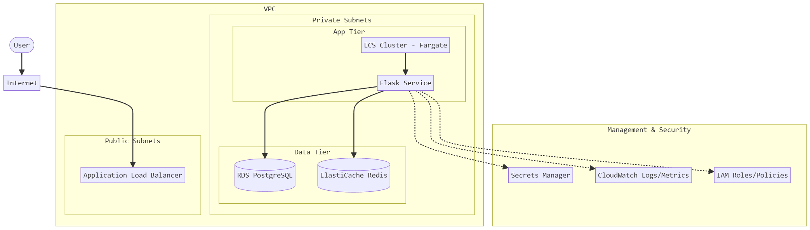
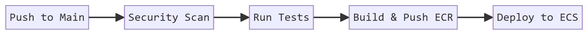

# AWS Architecture Design - MyCandidate

This document describes the proposed AWS architecture for deploying the MyCandidate application in a secure, scalable, and production-ready manner.

## Architecture Diagram

## Choice of Orchestration: Amazon ECS (Fargate)

For this project, I recommend **Amazon ECS with AWS Fargate**.

**Rationale:**
- **Simplicity:** ECS is easier to set up and manage compared to EKS, which is beneficial for smaller teams or projects with less complex orchestration needs.
- **Serverless (Fargate):** Fargate removes the need to manage EC2 instances, reducing operational overhead and improving security through task isolation.
- **Cost-Effective:** Pay only for the resources consumed by the tasks.
- **Integration:** Deeply integrated with other AWS services like IAM, Secrets Manager, and CloudWatch.

## Scaling Considerations & Cost Optimization

Thoughtful scaling is critical for civic technology applications that may experience sudden spikes in traffic during elections or campaigns, while remaining idle during off-seasons.

- **Horizontal Auto-scaling (ECS):** 
  - Configure ECS Service Auto Scaling using **Target Tracking Scaling Policies**.
  - **Metric:** Scale based on average CPU utilization (e.g., target 70%) or ALB Request Count Per Target. This ensures we add tasks proactively during traffic spikes.
- **ALB Target Groups:** Ensure the Application Load Balancer is configured with proper health checks to gracefully drain and replace unhealthy tasks without dropping user requests.
- **Database Scaling (RDS):** 
  - Use RDS Multi-AZ for high availability (failover).
  - Use **Read Replicas** for scaling read-heavy workloads (like retrieving candidate lists). Civic apps are typically read-heavy, making this highly cost-effective.
- **Caching Layer (Redis):** Use ElastiCache for Redis to aggressively cache database queries. This reduces the load on the expensive RDS instance, improving response times and lowering overall database costs.
- **Cost Optimization (Fargate Spot):** For background workers or non-critical web traffic, utilize **AWS Fargate Spot** capacity providers, which can save up to 70% on compute costs compared to on-demand pricing.

## Security Best Practices

- **VPC Isolation:** Place the application tasks and databases in private subnets with no direct internet access.
- **Least Privilege:** Use IAM Task Execution Roles and Task Roles with scoped-down permissions.
- **Secrets Management:** Use AWS Secrets Manager to store and rotate sensitive information like database credentials and API keys.
- **Security Groups:** Implement strict Security Group rules (e.g., ALB allows 80/443 from Internet, ECS allows 5000 from ALB, RDS allows 5432 from ECS).
- **Encryption:** Enable encryption at rest for RDS and ElastiCache, and encryption in transit (TLS) using ACM certificates on the ALB.

## Instance Sizing Recommendations

| Component | Sizing & Configuration | Rationale & Cost Thoughtfulness |
|-----------|------------------------|---------------------------------|
| **ECS Task (Web)** | 0.5 vCPU, 1 GB RAM (Fargate) | Flask API workers are relatively lightweight. Starting small and scaling out horizontally (adding more tasks) is better for fault tolerance than scaling up vertically. |
| **RDS (Postgres)** | `db.t4g.medium` (Multi-AZ) | Utilizing ARM-based Graviton2 (`t4g`) instances provides significantly better price-performance compared to previous generations (`t3`). |
| **ElastiCache (Redis)** | `cache.t4g.micro` | A small Graviton2 instance is extremely cheap and perfectly suited for the caching needs of a typical deployment of this size. |

## CI/CD Pipeline Proposal

**Tool:** GitHub Actions

1. **Source:** Trigger on push to `main` branch.
2. **Scan:** Run `safety` and `bandit` for security vulnerabilities.
3. **Test:** Run `pytest` to ensure logic and API endpoints are correct.
4. **Build:** Build Docker image and push to Amazon ECR.
5. **Deploy:** Update ECS Service with the new image definition using `aws ecs update-service`.

